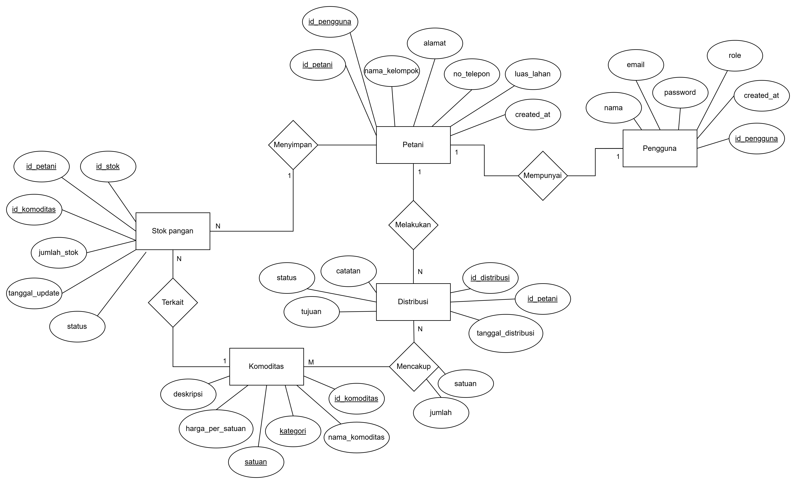
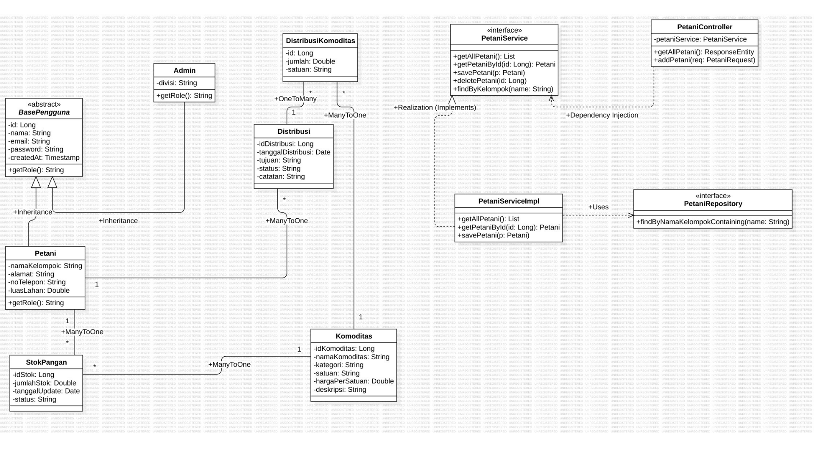

# SiKePang - Sistem Informasi Ketahanan Pangan Komunitas

**SiKePang** adalah sebuah Sistem Informasi Ketahanan Pangan Komunitas berbasis backend (REST API) yang dibangun menggunakan Java dan framework Spring Boot. Proyek ini dikembangkan sebagai pemenuhan tugas UTS Praktikum PBO / OOP oleh Kelompok 5 [BB-1].

## Tim Pengembang
- 152024032 – Zakhwa Aliya
- 152024035 – Putri Yudi Patrecia
- 152024047 – Zeta Mardhotillah Ronny
- 152024127 – Dzakiyya Puteri Aulia

## Latar Belakang & Tujuan
Indonesia sebagai negara agraris memiliki potensi pertanian besar, namun pengelolaan data pertanian dan distribusi pangan masih sering dilakukan secara manual dan konvensional. 

**Masalah:**
- Ketidakakuratan data stok pangan.
- Keterlambatan distribusi pangan.
- Sulitnya pemantauan secara *real-time*.
- Pencatatan manual rentan kesalahan dan sulit diakses banyak pihak.

**Tujuan Sistem:**
1. Membangun sistem backend Spring Boot untuk mengelola data petani, kelompok tani, dan komoditas pangan secara digital.
2. Menyediakan pencatatan & pemantauan stok pangan secara real-time.
3. Mengelola manajemen distribusi pangan.

## Teknologi yang Digunakan
- **Java 21**: Bahasa pemrograman utama berbasis OOP.
- **Spring Boot 3.2.x**: Framework Java untuk membangun REST API enterprise.
- **Spring Data JPA**: Abstraksi JPA untuk operasi database (CRUD, query).
- **MySQL 8.0**: RDBMS untuk penyimpanan data yang persisten.
- **REST API**: Arsitektur komunikasi HTTP (GET, POST, PUT/PATCH, DELETE) dengan format JSON.
- **Cloudflare Tunnel (Cloudflared)**: Untuk mengekspos API lokal ke publik.

## Batasan Sistem
**Termasuk (Do's):**
- Manajemen pengguna (Admin, Petugas, Petani) beserta autentikasi *role*.
- Manajemen petani & kelompok tani.
- Manajemen komoditas, kategori, dan satuan.
- Pengelolaan stok pangan (masuk, keluar, saldo).
- Manajemen distribusi pangan beserta detail komoditas.
- Monitoring ketersediaan dan riwayat distribusi.
- REST API publik via Cloudflare Tunnel.

**Tidak Termasuk (Don'ts):**
- Sistem pembayaran atau transaksi keuangan.
- Notifikasi real-time (Push, Email, SMS).
- Integrasi langsung ke sistem pemerintah/BULOG.
- Pengelolaan logistik dan pengiriman fisik.

## Penerapan Konsep OOP (4 Pilar Utama)
1. **Encapsulation (Enkapsulasi)**
   Semua atribut class (misalnya pada class `Petani`) dideklarasikan `private`. Akses dan modifikasi data dilakukan melalui metode *getter* dan *setter* yang sifatnya `public` serta dilengkapi validasi.
2. **Inheritance (Pewarisan)**
   Class seperti `Petani` dan `Admin` mewarisi (*extends*) dari *abstract class* `BasePengguna`. Dengan demikian, atribut umum seperti id, nama, email, password, dan createdAt diwariskan secara otomatis.
3. **Polymorphism (Polimorfisme)**
   Implementasi objek dapat memiliki banyak bentuk. Contohnya pada Controller, pemanggilan dilakukan melalui *interface* `PetaniService`, yang pada saat runtime akan menjalankan implementasi nyata pada class `PetaniServiceImpl`.
4. **Abstraction (Abstraksi)**
   Penggunaan *abstract class* `BasePengguna` yang mendefinisikan metode abstrak (misal: `getRole()`) yang harus diimplementasikan oleh *subclass*-nya.

## Desain Database
Sistem memiliki 6 entitas/tabel utama:
- `pengguna`
- `petani`
- `komoditas`
- `stok_pangan`
- `distribusi`
- `distribusi_komoditas`

### Relasi Antar Tabel:
- **Pengguna ↔ Petani**: *One-to-One* (1 akun pengguna untuk 1 data petani).
- **Petani ↔ Stok Pangan**: *One-to-Many* (1 petani dapat mencatat banyak stok pangan).
- **Komoditas ↔ Stok Pangan**: *One-to-Many* (1 komoditas memiliki banyak catatan stok).
- **Petani ↔ Distribusi**: *One-to-Many* (1 petani dapat melakukan banyak distribusi).
- **Distribusi ↔ Komoditas**: *Many-to-Many* (melalui *junction table* `distribusi_komoditas`).

## Entity Relationship Diagram (ERD)

## Class Diagram

## API Endpoints
Secara garis besar, terdapat lebih dari 23 endpoint dari 4 *resource* utama dan 1 monitoring dashboard (GET, POST, PUT, DELETE).

---
*Dibuat untuk keperluan Tugas Akhir Praktikum PBO / OOP (2026).*
