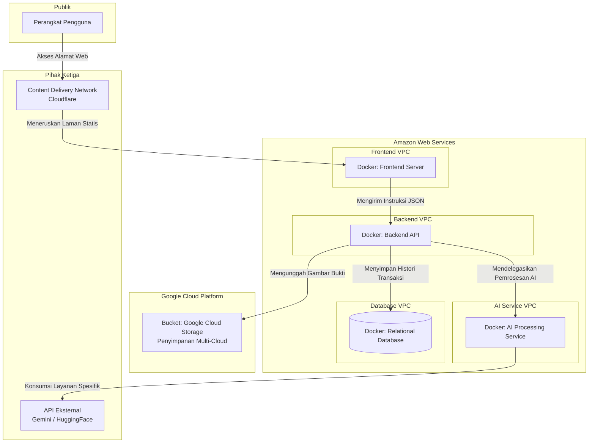
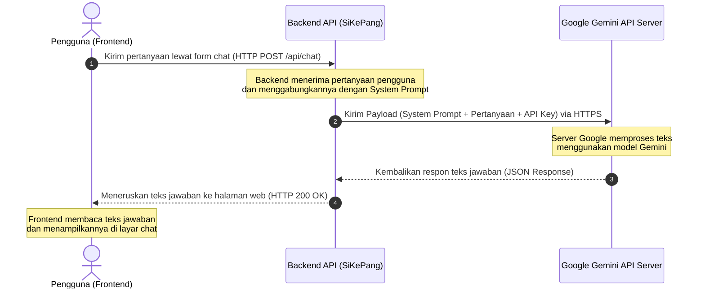

# Chat Conversation

Note: _This is purely the output of the chat conversation and does not contain any raw data, codebase snippets, etc. used to generate the output._

### User Input

Aku diberi tugas evaluasi akhir komputasi awan dengan persyaratan persyaratn yg tertera pada@[c:\KULIAH\Semester 4\Pemrograman Berorientasi Objek\SiKePang\EAS IFB302 Cloud_2026.docx.pdf] , sekarang bantu aku brainstorming kira kira fitur tambahan ai apa yg cocok dan mudah untuk aku implementasi ke website ini? Kalau comvis deteksi uang apakah bisa, tapi gimana ya cara nyambungin dengan tema sikepang ini? 

*Viewed [EAS IFB302 Cloud_2026.docx.pdf](file:///c:/KULIAH/Semester%204/Pemrograman%20Berorientasi%20Objek/SiKePang/EAS%20IFB302%20Cloud_2026.docx.pdf) *

### Planner Response

Berdasarkan dokumen pedoman Evaluasi Akhir Semester (EAS) yang Anda lampirkan, proyek Anda dituntut untuk merancang aplikasi berarsitektur Cloud Native dengan penerapan multicloud, segmentasi Virtual Private Cloud (VPC) yang terpisah, serta mengintegrasikan minimal satu fitur kecerdasan buatan (Artificial Intelligence).

Berikut adalah analisis komprehensif, pembaruan ide fitur, serta panduan teknis infrastruktur cloud yang disusun secara rinci dan akademik untuk proyek "SiKePang" Anda.

### 1. Analisis Relevansi Fitur Computer Vision "Deteksi Uang"
Ide untuk menggunakan Computer Vision (ComVis) untuk mendeteksi uang merupakan konsep yang sangat baik dan sepenuhnya sah secara teknis menurut pedoman dokumen. Computer Vision secara eksplisit tercantum sebagai salah satu opsi layanan kecerdasan buatan yang diperbolehkan. Tantangan konseptual yang Anda hadapi adalah bagaimana menghubungkan fitur ini dengan salah satu dari lima Sustainable Development Goals (SDGs) yang diwajibkan (Kesehatan, Reformasi Birokrasi, Pendidikan, Ketahanan Pangan, atau Mobilitas & Kota Cerdas), serta mencocokkannya dengan nama "SiKePang".

Apabila "SiKePang" merupakan singkatan dari **Sistem Ketahanan Pangan** (merujuk pada SDG nomor 4), fitur deteksi uang secara harfiah memiliki kaitan yang sedikit renggang dengan aktivitas pertanian. Namun, Anda dapat menyambungkan fitur ini melalui narasi berikut:
*   **Keamanan Finansial Transaksi Pengepul dan Petani:** Aplikasi SiKePang bertindak sebagai wadah digital untuk proses jual beli hasil panen antara petani desa dan pengepul pasar. Fitur deteksi uang menggunakan ComVis memindai lembaran uang kertas secara waktu nyata (real-time) melalui kamera ponsel petani. Sistem bertujuan mendeteksi keaslian uang untuk melindungi petani dari kerugian akibat peredaran uang palsu di pasar tradisional.
*   **Pemindaian Bukti Subsidi Pertanian:** Anda dapat menggeser fungsi deteksi bentuk uang menjadi Optical Character Recognition (OCR). Fitur ini membaca nominal uang dan data barang pada nota kertas pembelian pupuk bersubsidi, kemudian memproses data tersebut ke dalam laporan pangkalan data secara otomatis untuk mencegah manipulasi dana bantuan.

### 2. Rekomendasi Fitur Kecerdasan Buatan Alternatif (Lebih Mudah Diimplementasikan)
Jika Anda merasa fitur deteksi uang terlalu kompleks untuk dilatih atau naratifnya kurang kuat, saya memberikan beberapa alternatif fitur kecerdasan buatan yang sangat mudah diimplementasikan, sangat relevan dengan tema ketahanan pangan, dan memenuhi syarat integrasi Application Programming Interface (API) pihak ketiga.

*   **Asisten Cerdas Petani Berbasis Large Language Model (Sangat Direkomendasikan)**
    Anda dapat membangun fitur ruang obrolan (chatbot) interaktif yang memberikan saran mengenai cuaca ekstrem, waktu tanam, atau cara membasmi hama. Anda tidak perlu membangun model dari awal. Anda cukup menghubungkan backend aplikasi Anda dengan Google Gemini API atau OpenAI API. Proses ini sangat cepat karena Anda hanya mengatur perintah awalan (system prompt) yang memberikan identitas pada kecerdasan buatan tersebut sebagai pakar pertanian, lalu sistem akan meneruskan pertanyaan pengguna dan mengembalikan jawaban yang sudah diformat dengan rapi.
*   **Deteksi Penyakit Tanaman Melalui Citra Daun (Computer Vision)**
    Pengguna mengunggah foto daun padi atau jagung yang terlihat layu. Sistem mengirimkan foto tersebut ke layanan antarmuka model pra-latih (misalnya dari Hugging Face API) untuk mengklasifikasikan jenis penyakit dan memberikan rekomendasi tindakan. Implementasi ini memanfaatkan model yang sudah jadi, sehingga Anda terbebas dari proses pelatihan model yang memakan banyak waktu dan daya komputasi.

### 3. Penjelasan Rinci Implementasi Arsitektur Cloud Native
Dokumen EAS Anda memiliki bobot penilaian terbesar pada arsitektur cloud. Terdapat kewajiban untuk melakukan segmentasi Virtual Private Cloud dan menggunakan layanan multicloud. Berikut adalah instruksi teknis mendetail mengenai bagaimana Anda harus mengatur infrastruktur tersebut.

**A. Pengaturan Keamanan dan Segmentasi Virtual Private Cloud (VPC)**
Setiap komponen wajib diletakkan pada VPC yang berbeda untuk menjamin isolasi keamanan. Asumsikan Anda menggunakan layanan Amazon Web Services (AWS) EC2 untuk komputasi. Anda perlu mengatur aturan masuk (Inbound Rules) dan aturan keluar (Outbound Rules) pada fitur Security Group secara spesifik.

1.  **Frontend VPC (Server Antarmuka Pengguna):**
    *   **Inbound Rules:** Anda wajib membuka port HTTP (80) dan HTTPS (443) dengan sumber diatur ke `0.0.0.0/0`. Pengaturan ini mengizinkan semua pengguna internet untuk mengakses situs web Anda. Tambahkan port SSH (22) secara spesifik hanya dari alamat Protokol Internet (IP) komputer Anda untuk keperluan administrasi.
    *   **Outbound Rules:** Atur untuk mengizinkan semua lalu lintas IPv4 agar antarmuka dapat mengirimkan instruksi ke server backend.
2.  **Backend VPC (Server Logika Aplikasi):**
    *   **Inbound Rules:** Server ini dilarang keras terpapar ke internet publik secara langsung. Buka port aplikasi (misalnya port 8080) dan atur sumbernya HANYA dari alamat IP Privat milik instans EC2 Frontend Anda. Hal ini memastikan hanya situs web resmi Anda yang memiliki kemampuan untuk memanggil fungsi backend.
    *   **Outbound Rules:** Izinkan semua lalu lintas keluar agar backend dapat berkomunikasi dengan basis data, layanan kecerdasan buatan, dan layanan penyimpanan objek (Object Storage).
3.  **Database VPC (Server Pangkalan Data):**
    *   **Inbound Rules:** Buka port basis data (misalnya 3306 untuk MySQL atau 5432 untuk PostgreSQL). Atur sumber koneksi secara ketat hanya dari alamat IP Privat milik instans EC2 Backend. Data akan sangat aman karena sepenuhnya terisolasi.
    *   **Outbound Rules:** Tutup semua akses keluar kecuali jika Anda membutuhkan pembaruan sistem operasi server.
4.  **AI Service VPC (Server Kecerdasan Buatan):**
    *   **Inbound Rules:** Buka port spesifik layanan mikrokontroler (misalnya port 5000 jika menggunakan Python Flask). Atur sumbernya dari alamat IP Privat EC2 Backend.
    *   **Outbound Rules:** Buka port 443 ke seluruh jaringan agar layanan ini mampu mengakses antarmuka API pihak ketiga seperti Google Gemini atau Hugging Face.

**B. Implementasi Persyaratan Multicloud**
Pedoman menyebutkan bahwa penyimpanan ember (bucket) wajib berada di platform cloud yang berbeda dari server komputasi.
Jika Anda menggunakan mesin virtual EC2 dari Amazon Web Services, maka Anda harus menggunakan Google Cloud Storage (GCP Bucket) untuk memenuhi syarat multicloud. Aplikasi backend Anda bertanggung jawab untuk menerima unggahan berkas (seperti foto daun dari pengguna), lalu backend akan menggunakan sertifikat kredensial format JSON dari Google Cloud Console untuk mengirimkan berkas gambar tersebut secara terprogram menuju bucket penyimpanan GCP.

**C. Implementasi Pipeline CI/CD**
Dokumen meminta otomasi dari tahapan pembangunan hingga penerapan aplikasi. Anda dapat menggunakan GitHub Actions dengan instruksi alur kerja (workflow) mendetail sebagai berikut:
1.  **Proses Pembangunan (Build):** Server mengonfirmasi dan mempersiapkan instalasi paket atau modul yang dibutuhkan (seperti package.json atau requirements.txt).
2.  **Proses Pengujian (Test):** Mengeksekusi unit pengujian secara ringkas untuk menghindari aplikasi berhenti beroperasi saat diterapkan.
3.  **Proses Dockerize:** Sistem akan membaca dokumen Dockerfile pada masing-masing komponen untuk membungkus aplikasi beserta seluruh konfigurasinya menjadi sebuah citra kontainer utuh.
4.  **Proses Push Image:** Citra kontainer diunggah menuju tempat penampungan seperti Docker Hub.
5.  **Proses Penerapan Otomatis (Deploy):** Server CI/CD masuk secara aman ke dalam mesin EC2 menggunakan protokol SSH, lalu menginstruksikan mesin EC2 untuk mengambil citra terbaru dari Docker Hub dan menjalankan ulang wadah menggunakan Docker Compose tanpa intervensi manual dari kelompok Anda.

### 4. Diagram Arsitektur Sistem Sesuai Persyaratan Dokumen
Berikut merupakan representasi sintaks diagram arsitektur yang valid dan siap dieksekusi pada lingkungan Mermaid Live Editor. Diagram ini memvisualisasikan seluruh komponen wajib dan alur komunikasi jaringan pada sistem Anda.



Langkah selanjutnya adalah Anda perlu menentukan bersama rekan kelompok Anda apakah ingin mempertahankan konsep deteksi uang beserta narasi keamanannya, atau beralih menuju asisten bot ketahanan pangan yang secara teknis jauh lebih meminimalkan risiko kegagalan sistem pada saat presentasi langsung (No Cut No Edit) di hadapan dosen Anda.

### User Input

kalau aku pilih implementasi api ai itu susah ga sih? coba bantu aku brainstorming ntar apa aja yg harus disiapin, konsepnya gimana, alur kerjanya gimana, output akhirnya bakal kek gimana, anggap aja kamu adalah expert yg lg ngajarin orang yg bener bener gatau apa apa

### Planner Response

Sebagai seorang tenaga ahli yang akan membimbing Anda dari tahap awal, saya dapat menegaskan bahwa **mengimplementasikan API kecerdasan buatan pihak ketiga merupakan jalur yang sangat mudah, realistis, dan paling strategis** untuk tingkat kesulitan mahasiswa. 

Mengapa demikian? Karena fokus utama dari mata kuliah Komputasi Awan (Cloud Computing) adalah pengujian infrastruktur, jaringan, kontainerisasi, dan otomatisasi deployment, bukan pembuatan atau pelatihan model kecerdasan buatan dari nol. Jika Anda memilih menggunakan model lokal (seperti melatih Convolutional Neural Network untuk mendeteksi uang), Anda akan membuang banyak waktu untuk mengumpulkan dataset, melakukan pelatihan model, dan membutuhkan spesifikasi server cloud yang mahal (menggunakan GPU). Dengan menggunakan API seperti Google Gemini API, tingkat kesulitannya sama persis seperti Anda memanggil API cuaca atau API login biasa. Anda hanya mengirim data teks atau gambar melalui protokol HTTP, lalu menerima responnya dalam format JSON.

Berikut adalah rencana matang (brainstorming) yang mencakup persiapan, konsep, alur kerja, hingga luaran akhir yang harus Anda persiapkan.

---

### 1. Konsep Fitur AI: "Sikepang AI-Consultant"
Kita akan mengusung fitur bernama **Sikepang AI-Consultant**. Fitur ini merupakan asisten interaktif berbasis obrolan (chatbot) yang disematkan langsung pada dashboard website SiKePang. 

Konsep utamanya adalah membantu para petani, penyuluh pertanian, atau masyarakat umum dalam memecahkan masalah pangan secara instan. Pengguna dapat menanyakan tentang:
*   Gejala penyakit pada tanaman padi, jagung, atau singkong.
*   Dosis pupuk yang tepat untuk luas lahan tertentu.
*   Cara menangani gagal panen akibat cuaca ekstrem.

Untuk menjaga relevansi dengan tema SDGs Ketahanan Pangan, sistem backend Anda akan menyisipkan perintah tersembunyi (System Prompt) sebelum mengirimkan pertanyaan pengguna ke Google Gemini API. Perintah tersembunyi ini berbunyi: *"Kamu adalah pakar ketahanan pangan dan pertanian Indonesia yang bijaksana. Jawablah pertanyaan pengguna hanya jika berkaitan dengan pertanian, pangan, tanaman, dan pupuk. Tolak dengan sopan jika pertanyaan di luar konteks tersebut."*

---

### 2. Dokumen Persiapan (Apa Saja yang Harus Disiapkan?)
Untuk merealisasikan fitur ini, Anda hanya perlu menyiapkan empat elemen dasar berikut:

1.  **Kunci Akses API (API Key):**
    *   Buka situs Google AI Studio (ai.google.dev).
    *   Masuk menggunakan akun Google Anda.
    *   Klik tombol **Get API Key** lalu buat kunci baru. Kunci akses ini berupa string teks acak panjang yang berfungsi sebagai tanda pengenal aplikasi Anda agar diizinkan menggunakan model Google Gemini secara gratis.
2.  **Pustaka Perangkat Lunak (Library) pada Backend:**
    *   Jika backend website SiKePang menggunakan **Node.js (Express)**, Anda harus menginstal paket resmi: `@google/generative-ai`.
    *   Jika backend Anda menggunakan **Python (Flask/FastAPI)**, Anda cukup menginstal paket: `google-generativeai`.
3.  **Berkas Konfigurasi Keamanan (`.env`):**
    *   Buat berkas bernama `.env` di dalam proyek backend Anda untuk menyimpan kunci API tersebut. Jangan pernah menuliskan kunci API secara langsung di dalam kode program agar tidak disalahgunakan orang lain saat Anda mengunggah kode ke GitHub.
4.  **Desain Antarmuka Sederhana (Frontend):**
    *   Sebuah komponen kotak obrolan (chatbox) di halaman web yang memiliki input teks untuk mengetik pertanyaan dan tombol kirim, mirip seperti tampilan ChatGPT sederhana.

---

### 3. Alur Kerja Sistem (Workflow)
Proses pertukaran data dari pengguna hingga ke server Google Gemini dan kembali lagi berjalan melalui alur kerja berikut:



#### Penjelasan Rinci Alur Kerja:
1.  **Tahap 1:** Pengguna mengetik pertanyaan pada halaman web SiKePang, misalnya: *"Mengapa daun padi saya berwarna kuning bercak cokelat?"*, lalu menekan tombol kirim.
2.  **Tahap 2:** Kode JavaScript pada frontend mengirimkan pertanyaan tersebut ke server backend Anda melalui metode HTTP POST menuju endpoint `/api/chat`.
3.  **Tahap 3:** Backend menerima data tersebut. Backend kemudian memanggil pustaka Google Generative AI, menyisipkan instruksi bahwa AI harus bertindak sebagai pakar pangan, menggabungkannya dengan pertanyaan pengguna, lalu mengirimkannya ke server Google menggunakan API Key yang tersimpan di berkas konfigurasi `.env`.
4.  **Tahap 4:** Server Google memproses teks tersebut dalam hitungan detik.
5.  **Tahap 5:** Server Google mengirimkan balik hasil jawaban dalam format data JSON ke backend Anda.
6.  **Tahap 6:** Backend Anda menerima data JSON tersebut, menyaring bagian teks jawabannya saja, lalu mengirimkannya kembali ke frontend.
7.  **Tahap 7:** Frontend menerima jawaban teks dan menampilkannya di dalam gelembung obrolan sehingga pengguna dapat membaca saran solusi tersebut.

---

### 4. Gambaran Kode Program Backend Sederhana (Node.js Express)
Agar Anda memiliki gambaran nyata tentang kemudahan kodenya, berikut adalah contoh struktur kode yang akan berjalan pada server backend Anda:

```javascript
import { GoogleGenAI } from "@google/generative-ai";
import express from "express";
const app = express();
app.use(express.json());

// Inisialisasi API Gemini dengan kunci dari berkas .env
const ai = new GoogleGenAI({ apiKey: process.env.GEMINI_API_KEY });

app.post("/api/chat", async (req, res) => {
    try {
        const userMessage = req.body.message;
        const model = ai.getGenerativeModel({ model: "gemini-1.5-flash" });

        // Mengatur perilaku AI agar sesuai dengan tema Ketahanan Pangan
        const systemInstruction = "Kamu adalah konsultan pertanian SiKePang. Jawab pertanyaan seputar pertanian secara ilmiah dan praktis.";
        
        const result = await model.generateContent({
            contents: [{ role: "user", parts: [{ text: `${systemInstruction}\n\nPertanyaan: ${userMessage}` }] }]
        });

        const reply = result.response.text();
        res.status(200).json({ status: "success", reply: reply });
    } catch (error) {
        res.status(500).json({ status: "error", message: error.message });
    }
});
```

---

### 5. Hasil Output Akhir (Luaran)
Saat evaluasi akhir di depan dosen, fitur yang Anda tunjukkan adalah sebagai berikut:
1.  **Antarmuka Dashboard Interaktif:** Pada pojok kanan bawah halaman utama SiKePang, terdapat ikon bulat hijau. Ketika ikon diklik, akan muncul jendela obrolan bertuliskan *"SiKePang Smart Assistant"*.
2.  **Interaksi Real-Time:** Anda mendemonstrasikan pengetikan pertanyaan tentang pertanian, dan dalam waktu kurang dari 3 detik, sistem menampilkan solusi terstruktur (lengkap dengan poin-poin rekomendasi pupuk atau penanganan hama).
3.  **Filter Konten:** Ketika Anda mencoba memancing dengan pertanyaan di luar tema (seperti bertanya tentang resep masakan atau pemrograman), asisten AI akan menjawab: *"Maaf, sebagai asisten SiKePang, saya hanya dapat membantu Anda dalam topik ketahanan pangan dan pertanian."* Hal ini membuktikan bahwa Anda tidak sekadar melakukan bypass API biasa, melainkan merancang sistem tersebut dengan aturan bisnis yang matang.

Dengan menerapkan metode pemanggilan API seperti ini, Anda dapat menyelesaikan implementasi kecerdasan buatan hanya dalam waktu satu hingga dua hari kerja, sehingga sisa waktu pengerjaan proyek dapat Anda alokasikan sepenuhnya untuk mengonfigurasi VPC, Docker, CI/CD, dan infrastruktur multicloud yang memiliki bobot penilaian gabungan sebesar 50% pada lembar rubrik penilaian dosen.

### User Input

rencanany aku mau ambil api ai dari google buat implementasinya, coba bikinin aku tutorial step by step secar adetail buat konfigurasi dari awal sampe bisa deploy lokal dulu sebelum di upload ke aws, sekalian buatin fitur chatbotnya di proyek ini, abis itu kasih tau aku juga gimana cara up ke aws nya

*Listed directory [SiKePang](file:///c:/KULIAH/Semester%204/Pemrograman%20Berorientasi%20Objek/SiKePang) *

*Listed directory [sikepang-frontend](file:///c:/KULIAH/Semester%204/Pemrograman%20Berorientasi%20Objek/SiKePang/sikepang-frontend) *

*Viewed [build.gradle](file:///c:/KULIAH/Semester%204/Pemrograman%20Berorientasi%20Objek/SiKePang/build.gradle) *

*Viewed [package.json](file:///c:/KULIAH/Semester%204/Pemrograman%20Berorientasi%20Objek/SiKePang/sikepang-frontend/package.json) *

*Grep searched codebase*

*Listed directory [SiKePang](file:///c:/KULIAH/Semester%204/Pemrograman%20Berorientasi%20Objek/SiKePang/src/main/java/com/example/SiKePang) *

*Listed directory [config](file:///c:/KULIAH/Semester%204/Pemrograman%20Berorientasi%20Objek/SiKePang/src/main/java/com/example/SiKePang/config) *

*Viewed [CorsConfig.java](file:///c:/KULIAH/Semester%204/Pemrograman%20Berorientasi%20Objek/SiKePang/src/main/java/com/example/SiKePang/config/CorsConfig.java) *

*Listed directory [controller](file:///c:/KULIAH/Semester%204/Pemrograman%20Berorientasi%20Objek/SiKePang/src/main/java/com/example/SiKePang/controller) *

*Viewed [HomeController.java](file:///c:/KULIAH/Semester%204/Pemrograman%20Berorientasi%20Objek/SiKePang/src/main/java/com/example/SiKePang/HomeController.java) *

*Viewed [KomoditasController.java](file:///c:/KULIAH/Semester%204/Pemrograman%20Berorientasi%20Objek/SiKePang/src/main/java/com/example/SiKePang/controller/KomoditasController.java) *

*Listed directory [dto](file:///c:/KULIAH/Semester%204/Pemrograman%20Berorientasi%20Objek/SiKePang/src/main/java/com/example/SiKePang/dto) *

*Listed directory [response](file:///c:/KULIAH/Semester%204/Pemrograman%20Berorientasi%20Objek/SiKePang/src/main/java/com/example/SiKePang/dto/response) *

*Viewed [ApiResponse.java](file:///c:/KULIAH/Semester%204/Pemrograman%20Berorientasi%20Objek/SiKePang/src/main/java/com/example/SiKePang/dto/response/ApiResponse.java) *

*Listed directory [src](file:///c:/KULIAH/Semester%204/Pemrograman%20Berorientasi%20Objek/SiKePang/sikepang-frontend/src) *

*Listed directory [pages](file:///c:/KULIAH/Semester%204/Pemrograman%20Berorientasi%20Objek/SiKePang/sikepang-frontend/src/pages) *

*Listed directory [components](file:///c:/KULIAH/Semester%204/Pemrograman%20Berorientasi%20Objek/SiKePang/sikepang-frontend/src/components) *

*Viewed [App.jsx](file:///c:/KULIAH/Semester%204/Pemrograman%20Berorientasi%20Objek/SiKePang/sikepang-frontend/src/App.jsx) *

*Viewed [tailwind.config.js](file:///c:/KULIAH/Semester%204/Pemrograman%20Berorientasi%20Objek/SiKePang/sikepang-frontend/tailwind.config.js) *

*Listed directory [resources](file:///c:/KULIAH/Semester%204/Pemrograman%20Berorientasi%20Objek/SiKePang/src/main/resources) *

*Viewed [application.properties](file:///c:/KULIAH/Semester%204/Pemrograman%20Berorientasi%20Objek/SiKePang/src/main/resources/application.properties) *

*Listed directory [request](file:///c:/KULIAH/Semester%204/Pemrograman%20Berorientasi%20Objek/SiKePang/src/main/java/com/example/SiKePang/dto/request) *

*Viewed [KomoditasRequest.java](file:///c:/KULIAH/Semester%204/Pemrograman%20Berorientasi%20Objek/SiKePang/src/main/java/com/example/SiKePang/dto/request/KomoditasRequest.java) *

*Edited relevant file*

*Edited relevant file*

*Edited relevant file*

*Edited relevant file*

*Listed directory [services](file:///c:/KULIAH/Semester%204/Pemrograman%20Berorientasi%20Objek/SiKePang/sikepang-frontend/src/services) *

*Viewed [api.js](file:///c:/KULIAH/Semester%204/Pemrograman%20Berorientasi%20Objek/SiKePang/sikepang-frontend/src/services/api.js) *

*Edited relevant file*

*Grep searched codebase*

*Edited relevant file*

*Edited relevant file*

*Viewed [App.jsx](file:///c:/KULIAH/Semester%204/Pemrograman%20Berorientasi%20Objek/SiKePang/sikepang-frontend/src/App.jsx) *

*Edited relevant file*

*User accepted the command `.\gradlew.bat compileJava`*

*Viewed [README.md](file:///c:/KULIAH/Semester%204/Pemrograman%20Berorientasi%20Objek/SiKePang/README.md) *